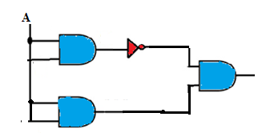
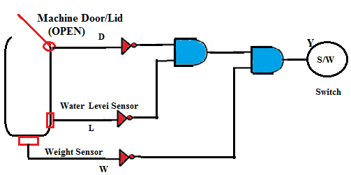

Q1. If the door is open, the level is high and the temperature is low, then _________.
A . Heater turns ON
B . **Heater turns OFF**
C . Heater burns
D . None of these

Q2. Choose the correct output for the circuit shown.

A . **0**
B . 1
C . A
D . A'

Q3. The Boolean expression Y for the given circuit diagram of the washing machine is ___________.

A . Y = D’ + L’ + W’
B . Y = (D + L + W)
C . **Y = D’ . L’. W’**
D . Y = (D. L. W)’

Q4. If any one or all the sensor outputs are 1, then the final output to the switch is _________.
A . **0**
B . 1

Q5. If the door/lid of washing machine is open or water level is below the minimum level or washing machine is overloaded, the main switch should be turned
A . **OFF**
B . ON

