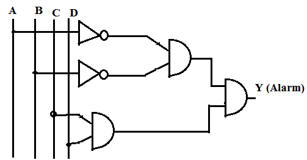
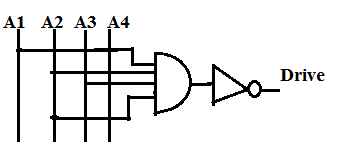
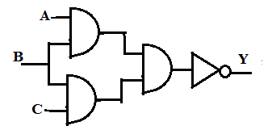
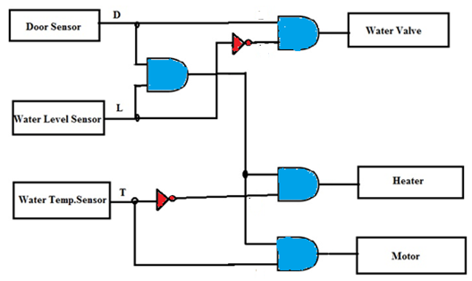

Q1. What inputs are required so that the combinational logic circuit in a washing machine triggers the alarm at output Y?

A . A=B=C=D=1
B . A=D=1,B=C=0
C . A=C=0,B=D=1
D . **A=B=0,C=D=1**

Q.2 The following AND-NOT circuit is used as a part of a drive spindle motor. The circuit is designed such that the motor turns ON when Drive= 1. Determine the input conditions necessary to turn ON the motor.

A . A1=A2=A3=A4=1
B . A1=A2=A3=A4=0
C . A1=A2= 0; A3=A4=1
D . **Both B and C**

Q3. Which of the following statements best describes the working of the following circuit?

A . A HIGH output occurs when all three inputs are LOW.
B . A HIGH output occurs when even a single input is LOW.
C . A HIGH output occurs when all three inputs are HIGH.
D .**Options A and B are TRUE.**

Q4. Which of the boolean expression is true for the washing machine circuit shown below?

A . Output = D.L.T
B . Output = D.L.T'
C . **Output = D.L'**
D . Output = D'.L

Q 5. State the output that is necessary to activate the Heater.
A . Output = D.L.T.
B . **Output = D.L.T'**
C . Output = D.L'.
D . Output = D'.L

