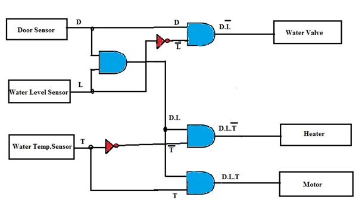

1.INTRODUCTION

When logic gates are connected together to produce a specific output for certain specific combinations of input variables, with no storage involved, the resulting circuit is called as a <i>Combinational logic </i>circuit. The combination of basic gates can be used for a variety of applications such as washing machine control, level monitoring and indicating applications in manufacturing processes, elevator control applications, a warning indicating applications and binary addition -subtraction and multiplication circuits.

1.1 APPLICATION:WASHING MACHINE CONTROLLER

For simplicity, consider a three-sensor based washing machine controller namely<i> Door Sensor, Water Level Sensor and Temperature Sensor </i>that produce<i> digital outputs</i>. Let the controlling action include control of <i>Water Valve, Heater and Motor</i>. All these are digitally controlled devices.

1.2 CONCEPT

The motor of the washing machine turns ON when the <i>right temperature</i>, the <i>right water level </i>and obviously when<i> the door of the machine is closed</i>.

The system design involves three inputs: D, L & T representing Door position, Level & Temperature respectively. It controls three output devices: W, H & M representing Water Valve, Heater & Motor respectively. Let us decide the logics behind the system:

 

D = 0 ------- Door Open;

D = 1-------- Door Closed (desired)

L = 0 --------Water Level is LOW;

L = 1 --------Water Level is HIGH (satisfactory)

T = 0 --------Temperature is LOW

T = 1 --------Temperature is HIGH (right value)

The truth table for this application can be developed by logical reasoning:

1.   For turning ON of any of the output devices, <i>the washing machine door/lid should be closed</i> at any point of time, so only last four cases of the truth table should to be considered where D takes a value 1.

2.    If door is closed & water level is LOW, the water valve should be turned ON.

3.    If door is closed, water level is satisfactory (HIGH) & the temperature is low, the heater should be turned ON.

4.    Whereas when the door is closed, water level is satisfactory and the temperature is right, the motor should turn ON.

| Door(D)| Level(L) | Temperature(T)| Valve(V)| Heater(H)| Motor(M)|
|:---:|:----:|:-----:|:-----:|:----:|:----:|
|0|0|0|0|0|0|
|0|0|1|0|0|0|
|0|1|0|0|0|0|
|0|1|1|0|0|0|
|1|0|0|1|0|0|
|1|0|1|1|0|0|
|1|1|0|0|1|0|
|1|1|1|0|0|1|

Considering only those input conditions that produce a HIGH output, we get the reduced Boolean expressions for controlling as follows:

<b>Water Valve (V) = D.L'

Heater (H) = D.L.T'

Motor (M) = D.L.T</b>

The corresponding combinational logic circuit is as shown in Figure 1.

